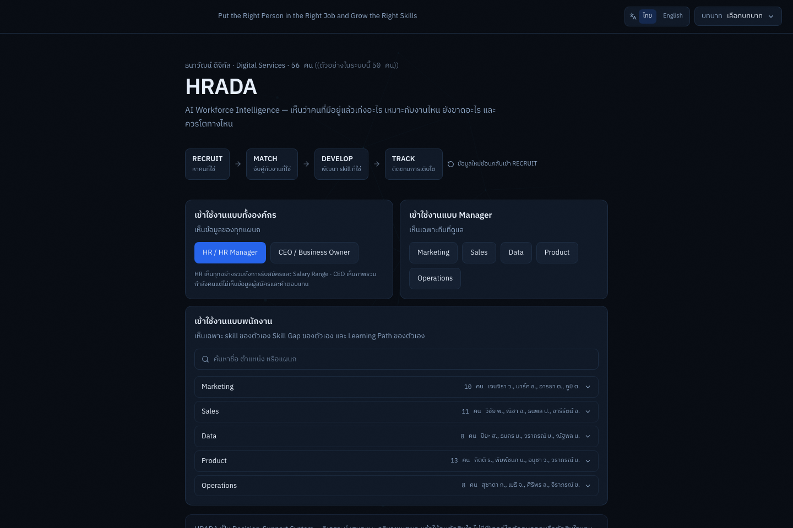
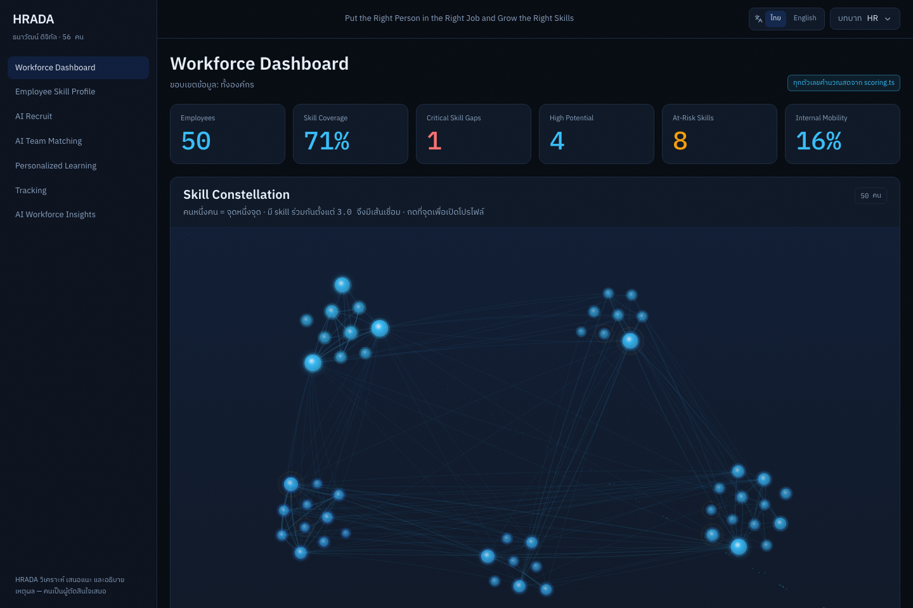
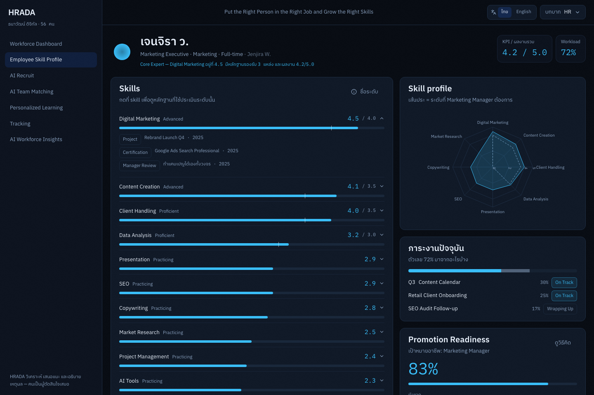
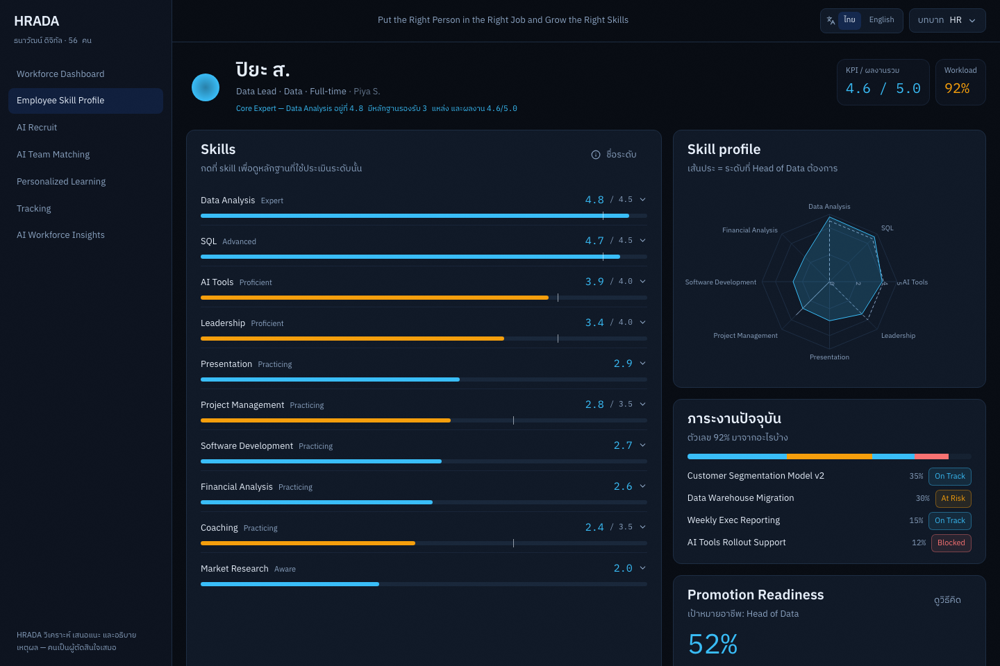
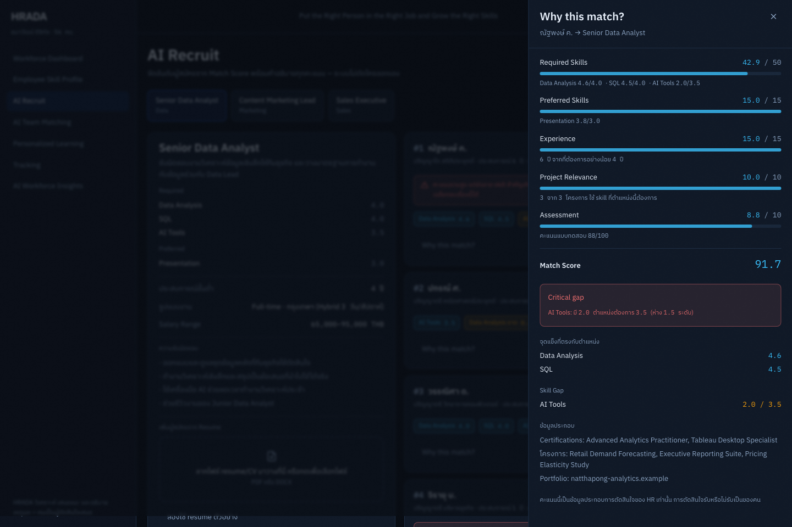
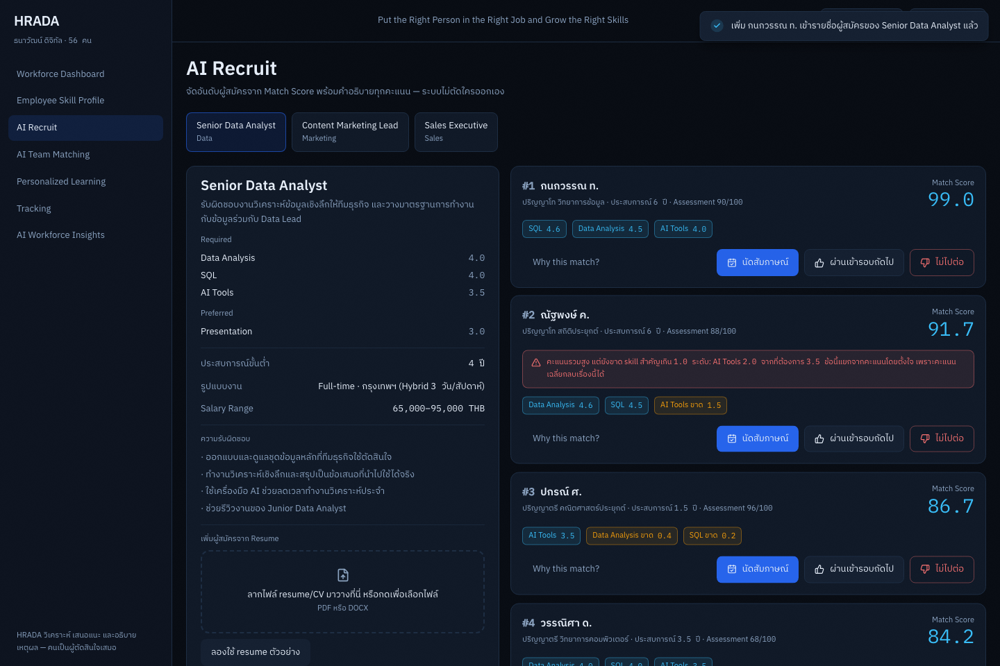
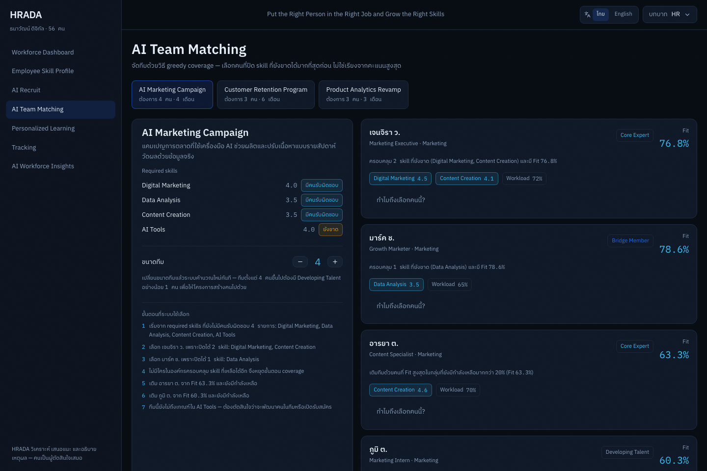
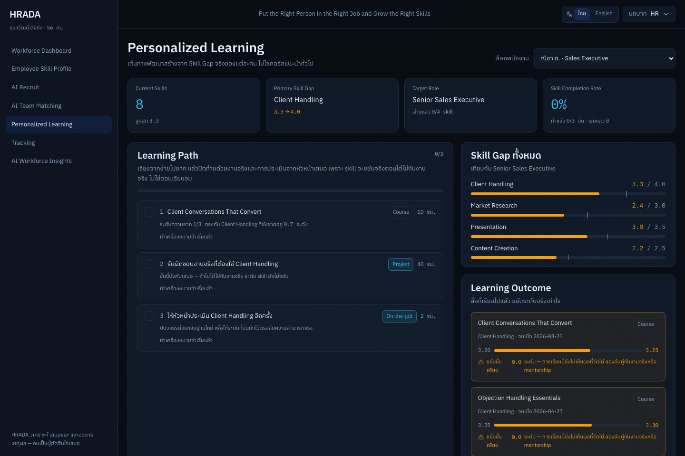
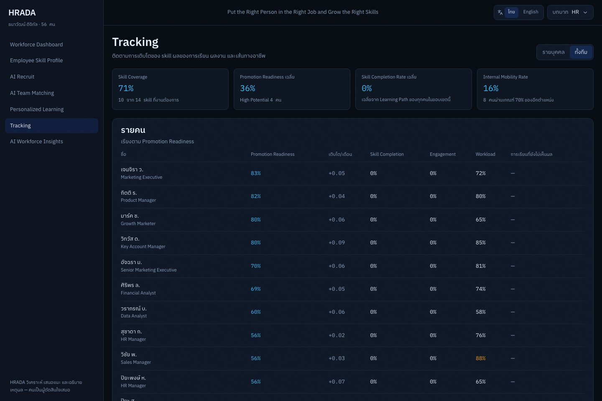
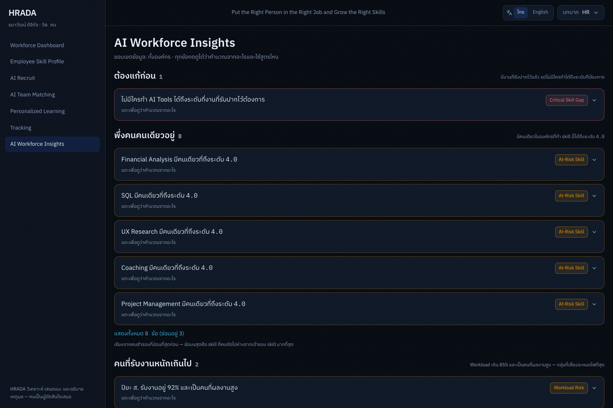

# HRADA — AI Workforce Intelligence

**Put the Right Person in the Right Job and Grow the Right Skills.**

HRADA is a clickable frontend prototype of a workforce intelligence platform for growing
Thai SMEs (roughly 20–500 employees). Most organizations aren't actually short on talented
people — they don't know what the people they already have are good at, or how to use them
well. That information is scattered across resumes, HR databases, performance reviews,
training records, and manager assessments. HRADA's answer is the **Employee Skill Graph**:
instead of storing someone as "Marketing Executive," it holds their skills and levels, the
evidence behind each level, their projects, performance, learning history, career goal, and
current workload — then builds recruiting, team-matching, learning, and tracking on top of
that one shared model. The product loop is **RECRUIT → MATCH → DEVELOP → TRACK**, with new
data feeding back into RECRUIT.

## Screenshots

### Entry & Role Selection



Four ways into the same dataset — org-wide (HR/CEO), scoped to one department (Manager), or
signed in as one specific person (Employee) — with a searchable, department-grouped picker
instead of a flat name list.

### HR Workforce Dashboard



The Skill Constellation is the centerpiece: one node per person, a line wherever two people
share a skill at 3.0 or above, and a slow pulse on anyone over 85% workload — clustered by
department, with cursor-magnetic drift and an idle twinkle that never overlaps a node under
any cursor position.

### Employee Skill Profile



Every skill level expands to the evidence behind it — a project, a certification, a manager
review — so a number on screen is never just asserted.

### Workload, Explained



Workload % used to be a bare number with nothing behind it. It now breaks down into the 2–4
current assignments that make it up — a stacked bar plus a short list, each item's status
(On Track, At Risk, Wrapping Up, Blocked) — on the profile, and inline wherever Team Matching
flags someone as a workload risk. Not a task board: no drag targets, nothing to reorder, just
enough structure to make the percentage explainable.

### AI Recruit



The highest match score and a critical skill gap can belong to the same candidate at once —
the "Why this match?" panel shows the full weighted breakdown so the gap can't get buried
inside an average.

### Resume Drop-Zone (Simulated)



A drag-and-drop zone (or "Try a sample resume," for anyone without a file handy) plays the
same themed analysis loader as the rest of the product, then adds a new candidate straight
into the ranked list — same Match Score formula, same "Why this match?" panel, plus an
"Extracted from the resume" section quoting the excerpt each skill level is attributed to.
No file is ever actually parsed: a small, fixed pool of pre-written outcomes stands in for
what a real resume-parsing model would return, and an honest label next to the drop-zone
says so.

### AI Team Matching



Teams are assembled by which open requirement each person closes next, not by stacking the
highest individual scores — talent-type badges (Core Expert, Bridge Member, Developing
Talent) show why each person made the cut.

### Personalized Learning



A learning path built from one person's actual skill gap, with a before/after outcome per
completed item and a low-outcome warning when a finished course barely moved the needle.

### Tracking



Org-wide and per-person KPIs — skill coverage, promotion readiness, skill completion,
internal mobility — sortable by whoever is closest to ready.

### AI Workforce Insights



Insights are grouped by what kind of problem they are (critical gap, at-risk skill, workload
risk), capped at five per group with the rest behind an expand, so the list stays readable at
any dataset size.

## Quick Start

Prerequisites: **Node 20 or newer**, and `npm`.

```bash
git clone https://github.com/Pug-03/Hrada_.git
cd Hrada_
npm install
npm run dev
```

Open **http://localhost:5173/Hrada_/** (the trailing `/Hrada_/` matches the `base` path used
for GitHub Pages — see [Deployment](#deployment)).

There is no backend, no database, and no LLM call at runtime — all data lives in
`src/data/`, and every figure on screen is computed in the browser.

## Available Scripts

| Script | What it does |
| --- | --- |
| `npm run dev` | Starts the Vite dev server with hot reload |
| `npm run build` | Type-checks (`tsc -b`) then builds the production bundle to `dist/` |
| `npm run preview` | Serves the production build locally, for a closer-to-deploy check |
| `npm test` | Runs the full Vitest suite once (`vitest run`) |
| `npm run typecheck` | Type-checks the app and the test suite separately (`tsc -b` + `tsc -p tsconfig.test.json`) |
| `npm run lint` | Runs Oxlint |

## Tech Stack

- **React 19.2** + **TypeScript** + **Vite 8** (rolldown-vite)
- **React Router 7** — real routes, not tab state, so permissions are enforced at navigation
  time and the browser's back button works
- **Tailwind CSS 4** — design tokens declared in an `@theme` block in `src/index.css`
- **Framer Motion 13** — every animation in the app, including the Skill Constellation's
  layout, drift, and shared-layout page transitions
- **Recharts 3** — the radar and line charts
- **Zustand 5** — app state (session, learning progress, toast queue), persisted to
  `localStorage`
- **Vitest 4** + **@testing-library/react 16** + **jsdom** — the test suite
- **Oxlint** — linting
- `date-fns`, `clsx`, `tailwind-merge`, `lucide-react`, `@fontsource/ibm-plex-mono`,
  `@fontsource/ibm-plex-sans-thai` for dates, class merging, icons, and self-hosted fonts

Exact versions are pinned in `package.json`.

## Project Structure

```
src/
  data/          Mock data: 14 hand-authored + 36 generated employees, skills, roles,
                 jobs, candidates, resume samples, projects, and the learning catalog
  lib/           scoring.ts (every calculation in the product), constellation.ts (the
                 skill-graph layout), permissions.ts (who can see what), theme.ts
                 (design tokens mirrored for TS), i18n/ (Thai/English dictionaries)
  components/    UI primitives (Button, Card, Badge, ...), charts/, and the
                 SkillConstellation/ component
  pages/         The eight screens behind a role, plus Entry and NotAuthorized
  store/         Zustand stores — session, learning progress, decisions, toasts —
                 persisted to localStorage
  hooks/         Small shared hooks (an analysis-loader timer, a count-up animation)
  test/          Screen renders across every role, design-rule guards, and
                 dataset-integrity checks that don't fit next to one lib file
```

## Key Design Principles

- **Decision-support, never decision-making.** Every path through the product is
  *analyze → recommend → explain → a human decides*. Nothing auto-rejects a candidate,
  auto-assigns a person to a team, or approves a promotion — every recommendation carries the
  reasoning behind it, and a human acts on it.
- **One file computes every number.** `src/lib/scoring.ts` holds all the arithmetic as pure
  functions, each returning both a value and the reasoning behind it. Screens render numbers;
  they never compute them, and nothing is hardcoded — change a skill level in
  `src/data/employees.ts` and every dependent figure on every screen moves with it.
  `src/lib/constellation.ts` does the same for the skill-graph layout.
- **Bilingual by default, role-scoped by construction.** Every screen renders in Thai or
  English from one dictionary pair (`src/lib/i18n/th.ts` / `en.ts`) with no partial
  translations, and `src/lib/permissions.ts` gates both routing and the data a session can see
  for four roles — HR, Manager, Employee, CEO — so hiding a menu item with CSS is never the
  permission model.
- **Frontend-only prototype.** No backend, no database, no real authentication, and no AI API
  call at runtime — every "AI-generated" number is a deterministic calculation over mock data,
  reproducible and free to run.

## Known Limitations / Out of Scope

This is a prototype of the decision layer, not a production HR system. It deliberately does
not include:

- A backend, database, or real authentication (role switching is a demo convenience, not a
  login)
- Real AI/LLM calls — every score, match, and recommendation is a pure function over
  hand-authored and generated mock data
- Payroll, attendance, a full LMS, or ERP/CRM integration
- Data persistence beyond the current browser (Zustand's `localStorage` persistence covers a
  demo surviving a refresh, nothing more)

The original product specification is kept in `spec/` for reference.

## Live Demo

**https://pug-03.github.io/Hrada_/**

Deployed automatically on every push to `main` via GitHub Actions
(`.github/workflows/deploy.yml`) using the official `actions/deploy-pages` flow. The app uses
`HashRouter` (URLs like `/Hrada_/#/dashboard`) since GitHub Pages has no server-side rewrite
rule for a static SPA's clean routes.

## Testing

```bash
npm test
```

293 tests across 17 files, covering:

- **Every scoring function** in `src/lib/scoring.ts` — one describe block per spec section,
  each asserting the actual formula, not just "it runs."
- **Dataset integrity**, including that the 14 hand-authored people from the original spec
  are preserved exactly (same ids, names, skills) no matter how the generated population
  around them changes.
- **Planted-case verification** — the spec plants specific, deliberate outcomes in the data
  (AI Tools as the only critical skill gap with zero qualified people, UX Research and
  Financial Analysis each at-risk with exactly one qualified person, Piya and Wichai as the
  only two workload-risk cases, Jenjira/Mark/Kitti guaranteed inside High Potential) and the
  suite re-verifies every one of them against the live dataset rather than assuming they still
  hold after a data change.
- **The two mock-data pools behind Workload and the resume drop-zone** (`activeWork` in
  `src/data/employees.ts`, `src/data/resumeSamples.ts`) — every person's work items sum to
  roughly their workload percentage without exceeding it, every resume sample actually clears
  its target job's required-skill bar, and every job has enough samples that demoing it twice
  in a row draws a different result.
- **Design-rule guards** (`src/test/design-rules.test.ts`) — unusual because they check the
  *source code* with regexes rather than rendered output: the color palette stays closed to
  the tokens declared in `theme.ts` (no stray hex literals anywhere else), and any place that
  clears a focus outline (`outline-none`) is required to restore one, so an accessibility
  regression fails the build instead of waiting for a manual review to catch it.
- **Screen renders** across every role that can and cannot open them, permission redirects,
  the constellation's hover/click behavior, reduced-motion behavior, locale switching, and a
  guard that every digit rendered anywhere in the app uses the monospace figure style.
